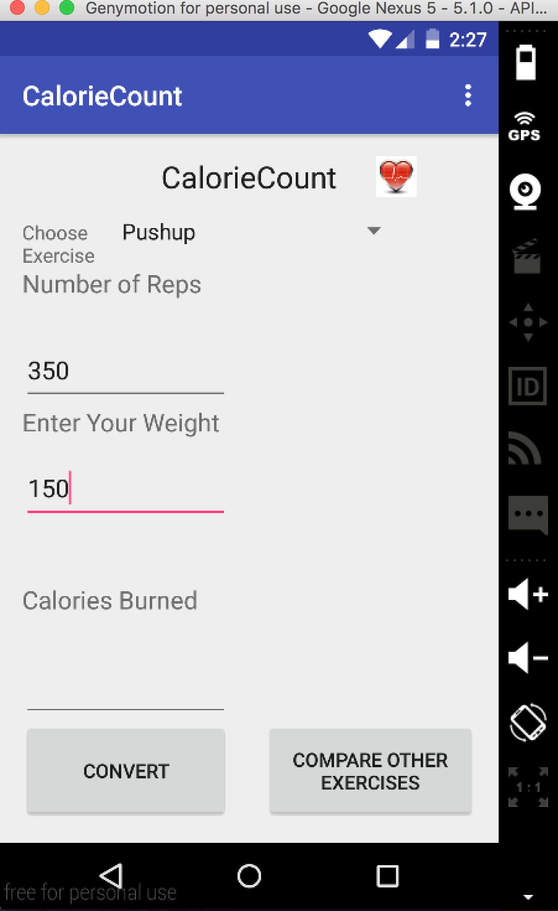

# PROG 01: Crunch Time

Briefly describe your app here.

My app, called CalorieCount, is a simple Android application with many different workout metrics designed to be a convenient calorie conversion application for anyone to use effectively. 

## Authors

Matt Turk ([your_email@berkeley.edu](mturk@berkeley.edu))

## Demo Video

See [CalorieCount Android](https://youtu.be/R499l-sYFpY)

## Screenshots

## Acknowledgments

* Hat tip to anyone who's code was used
* Any other support

*Feel free to enhance your README. For Markdown syntax, see [the GitHub Guides](https://guides.github.com/features/mastering-markdown/). Remove this line in your submission.*
